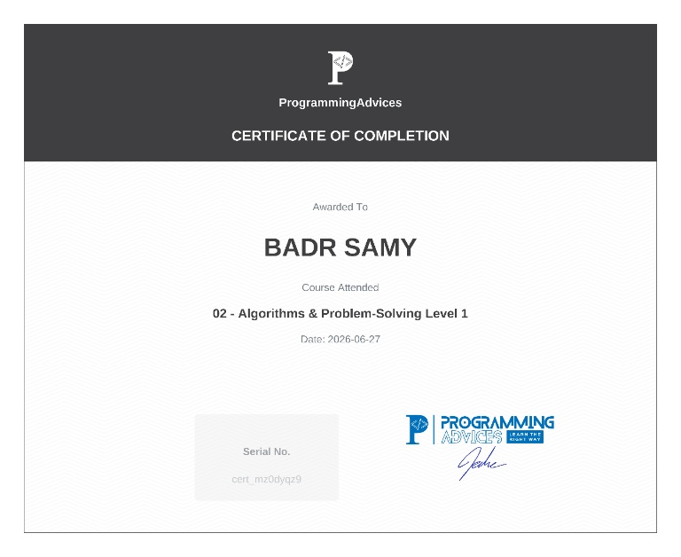

# Algorithms & Problem-Solving - Level 1

This repository documents my completion, solutions, and logic-building notes for the **Algorithms & Problem-Solving Level 1** course on the ProgrammingAdvices platform, taught by Dr. Mohammed Abu-Hadhoud.

## 🧠 What I Covered
* Logic formulation and breaking down complex problems.
* Building and tracing structural **Flowcharts**.
* Writing clean and readable **Pseudocode**.
* Understanding loops (`While` loops), conditions (`If-Else`, `Switch Case`), and control flow logic.

## 🎓 Completion Certificate
Below is my official certificate of completion:

